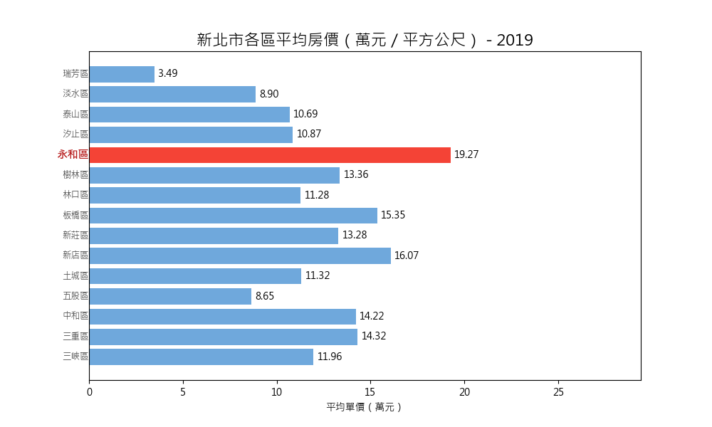

# 🏠 新北市不動產價格趨勢分析（2018–2025）



本專案以內政部實價登錄資料為基礎，透過 Python 進行資料整理、視覺化與趨勢分析，探索 2019–2025 年新北市不動產市場的變化情形。

📈 使用工具：Python + pandas + matplotlib  
📊 產出內容：趨勢圖、區域房價比較、動畫視覺化  
📁 專案結構：已整理為清晰的 `data / src / charts / animation` 模組結構

---

## 📁 專案內容模組

### 1️⃣ 建物面積 vs 總價關係圖（含趨勢線）

> 🔹 程式：`src/(散佈圖)新北市2018-2024不動產買賣 建物面積vs總價.py`  
> 🔹 圖片：`charts/新北市(2018-2024)不動產買賣 建物面積vs總價.png`

分析房屋面積與總價的線性關係，並加入趨勢線（回歸線）強調整體正向變化。

不動產買賣 建物面積vs總價.png)

---

### 2️⃣ 各行政區平均房價比較長條圖

> 🔹 程式：`src/(長條圖)新北市各行政區平均房價.py`  
> 🔹 圖片：`charts/avg_price_by_district.png`

視覺化不同行政區的平均房價高低，並以紅色標示房價前五名行政區。

各行政區平均房價.png)

---

### 3️⃣ 房價變化動畫圖（Bar Chart Race）

> 🔹 程式：`src/(動畫)新北市2019-2025各行政區房價變化.py`  
> 🔹 動畫：`animation/price_trend.gif`

以動畫方式動態呈現每年房價變化趨勢，顯示價格升降情形並強調當年度最高價區域。


---

## ⚙️ 環境與套件安裝

```bash
pip install -r requirements.txt
