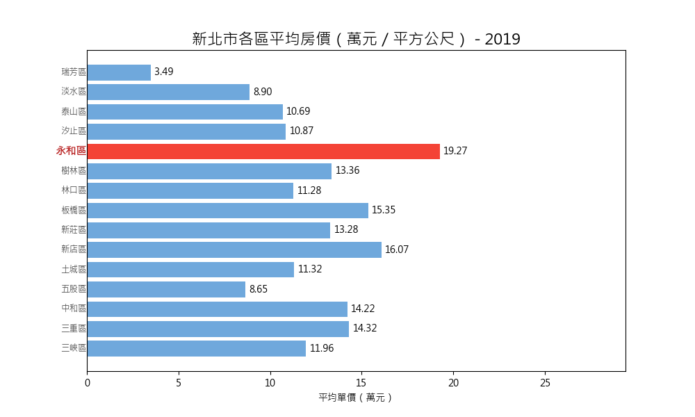

# 🏠 New Taipei Real Estate Price Trend Analysis (2019–2025)




This project analyzes the real estate transaction data of New Taipei City from 2019 to 2025 using Python, pandas, and matplotlib. It provides visualizations and insights on regional housing price trends, ideal for data portfolio and analytics interviews.

---

## 📁 Project Overview

### 1. Price vs Area Trend Visualization
> 🔹 Script: `src/(散佈圖)新北市2018-2024不動產買賣 建物面積vs總價.py`  
> 🔹 Image: `charts/price_vs_area_v2.png`

A scatter plot with regression line showing the relationship between building area and total price.

### 2. Average Price by District Bar Chart
> 🔹 Script: `src/(長條圖)新北市各行政區平均房價.py`  
> 🔹 Image: `charts/avg_price_by_district_v2.png`

Bar chart visualizing average unit price (per ㎡) across all districts in New Taipei City. Top 5 districts highlighted in red.

### 3. Animated Housing Price Changes (Bar Chart Race)
> 🔹 Script: `src/(動畫)新北市2019-2025各行政區房價變化.py`  
> 🔹 GIF: `animation/price_trend_v2.gif`

Dynamic bar chart showing annual price changes by district. Highlights highest-price district each year and includes price change markers.

---

## ⚙️ Setup Instructions

```bash
pip install -r requirements.txt
```

---

## 📊 Data Source

- [Taiwan Ministry of the Interior Real Estate Transactions](https://data.ntpc.gov.tw/datasets/ACCE802D-58CC-4DFF-9E7A-9ECC517F78BE)

---

## 👨‍💻 Author

Ethan Tsao  
GitHub: [dongdong7048](https://github.com/dongdong7048)

---

## 💡 Purpose

This project serves as a side project for interview preparation, showcasing data wrangling, visualization, and trend analysis skills using real-world real estate data from Taiwan.

